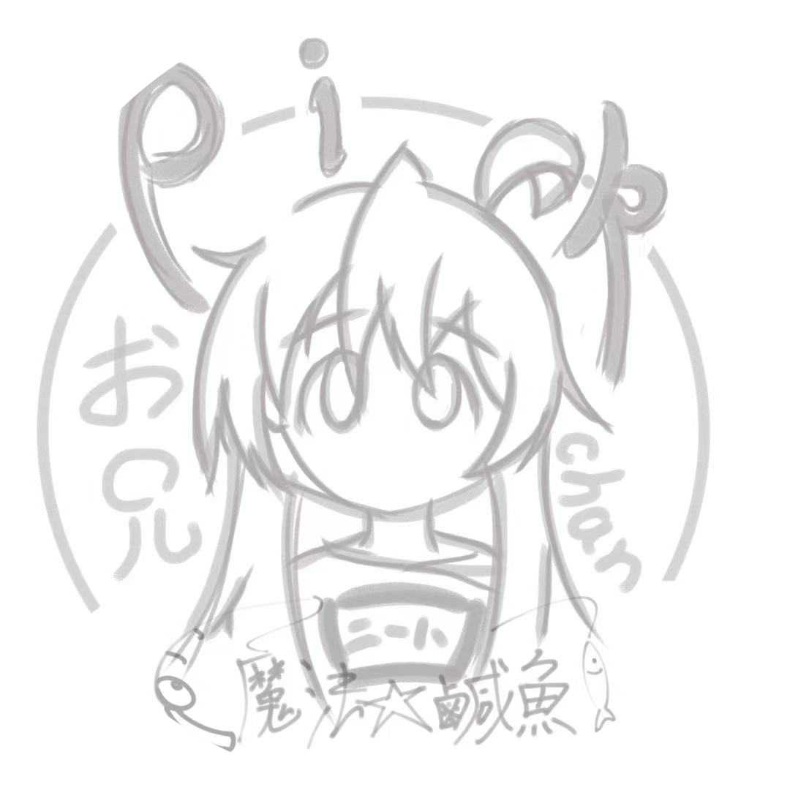
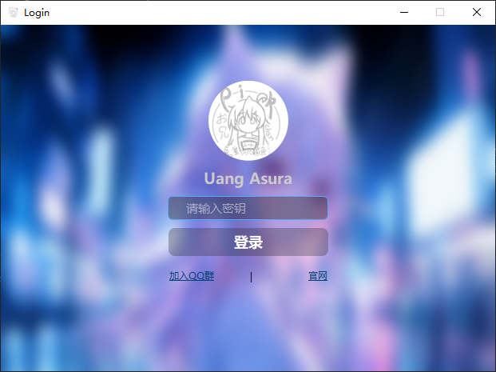
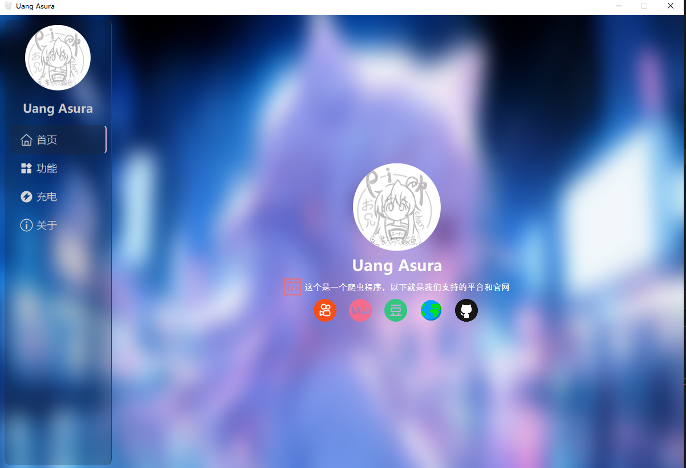
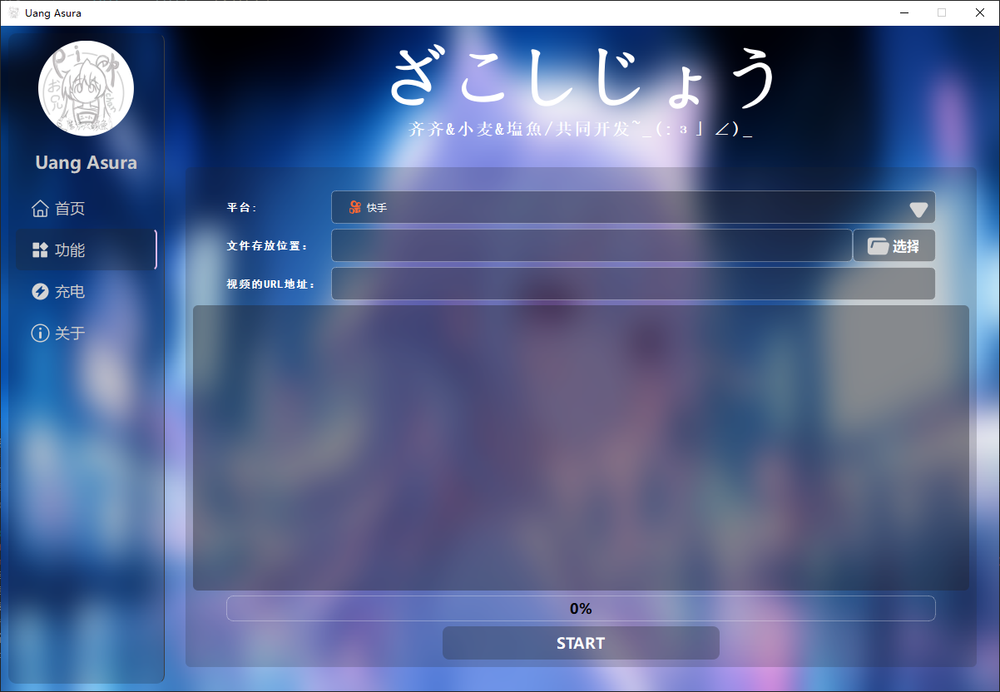
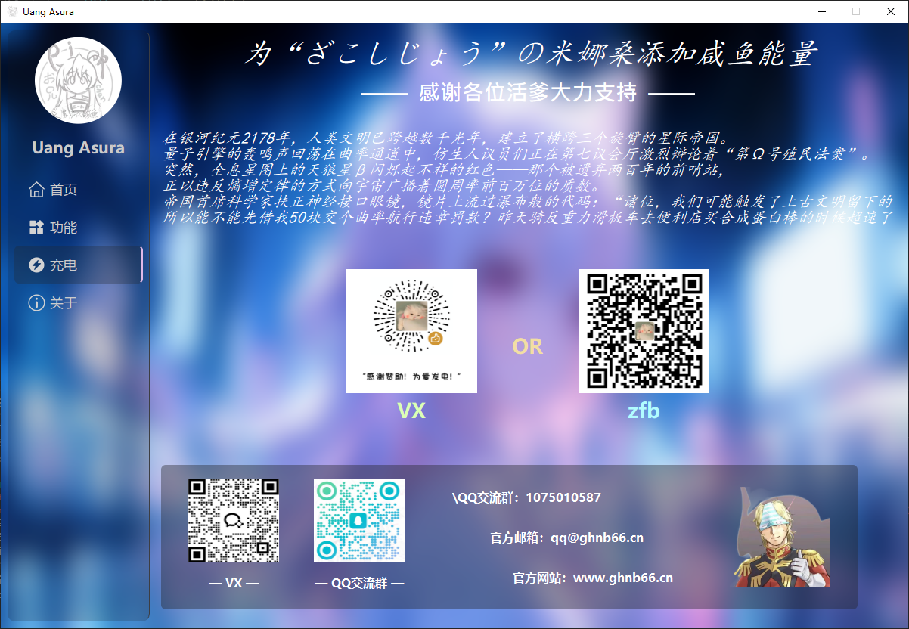
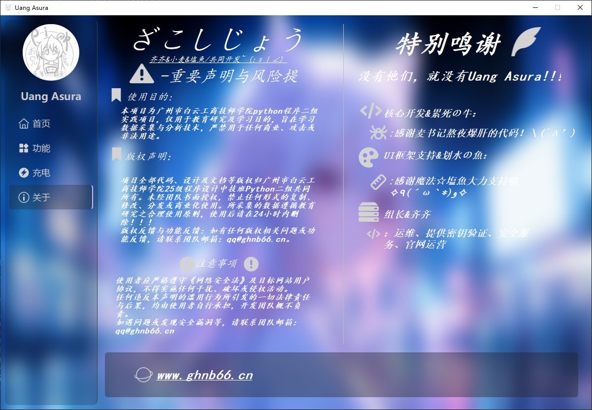

    
  

# 项目界面展示（UI Preview）

## 登录界面

    

## 首页界面

    

## 功能界面

    

## 充电界面

    

## 关于界面

    

> *图：基于 Qt Widgets 的程序登录界面设计*

---

## 界面说明

* **工具与框架**：Qt Widgets Designer + PySide6
* **界面风格**：简洁，突出功能入口
* **设计理念**：UI 与业务逻辑分离，模块化设计

---

## 主要元素

* **项目名称**：中央显示 **Uang Asura**
* **用户输入**：

  * 密钥输入框（支持密码隐藏/显示）
  * 登录按钮进入主程序
* **功能链接**：

  * “购买密钥”：获取测试密钥（教学演示）
  * “官网”：跳转项目主页
* **资源管理**：背景与图标通过 Qt 资源系统（`.qrc`）统一管理

---

## 技术要点

* Qt Widgets + Qt Designer
* PySide6 信号与槽
* 模块化界面设计（便于后续扩展账号体系与权限验证）

---

如果你需要，我可以帮你生成一个 **更紧凑的 PDF 预览文档**，包含压缩后的图片，方便展示给其他人。

你希望我直接生成这个 PDF 版本吗？
