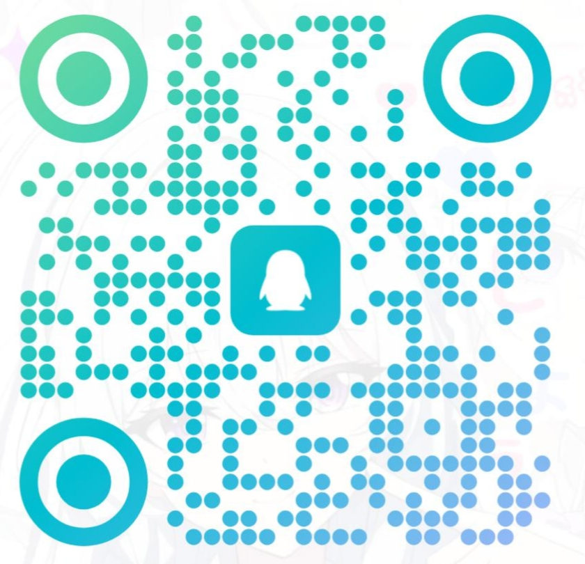

##  项目界面展示（UI Preview）

    

---

###  登录界面

    

###  首页界面

    

###  功能界面

    

###  充电界面

    

###  关于界面

    

> 图示：基于 **Qt Widgets + PySide6** 构建的桌面应用界面

---

##  界面概述

* **开发工具**：Qt Widgets Designer + PySide6
* **整体风格**：简洁直观，突出核心功能入口
* **设计原则**：

  * UI 与业务逻辑解耦
  * 模块化界面结构，便于维护与扩展

---

##  主要界面元素

###  核心信息

* **项目名称**：`Uang Asura`（居中展示）
* **统一视觉风格**：图标与背景资源通过 Qt 资源系统统一管理

###  登录模块

* 密钥输入框（支持 **密码隐藏 / 显示切换**）
* 登录按钮（校验通过后进入主程序）

###  功能入口

* **官方网站**：通过超链接跳转至项目主页

---

##  技术实现要点    

* Qt Widgets + Qt Designer 可视化设计
* PySide6 信号与槽机制
* 界面模块化拆分（便于后期扩展账号体系、权限验证等功能）
* 资源统一管理（`.qrc`）

## 使用Uang Asura必读声明

* 该项目由广州市白云工商技师学院，2025级程序设计中技班python二组实践项目
* 团队成员等详细可看官网： https://www.ghnb66.cn/ 
* 用于代码研究以及课后项目。用于学习为目的，数据采集和分析。
* 代码开源，但仅只能用于学习用途。【禁止使用在商业用途或攻击等非法用途】
* 不能对目标网站实施干扰，破坏及侵权行为。
* 请使用者严格遵守国家的法律法规！！！
* 如果滥用所引发的一切法律责任与后果均由使用者承担所有责任，开发团队概不负责！！！
* 有问题可联系邮箱： qq@ghnb66.cn
* 该项目，代码版权归属：广州市白云工商技师学院2025计算机程序设计中技班Python二组。
* 使用后请在24小时内删除相关内容。

## QQ交流群
<a href="https://qun.qq.com/universal-share/share?ac=1authKey=VbKjg3QhTPZXx20FDg1PCyXf0ErU4LluiYPXDLrbEEPuW2IX4TxLgX0ll6DW4LFbusi_data=eyJncm91cENvZGUiOiIxMDc1MDEwNTg3IiwidG9rZW4iOiJ6MU41dGRKa10ZDBuOTJiNFp5THRKVk1BalpFdmhrbW5VSkp0RGpTejAxclEydDkxSmhIaVFPcll6Mp1bWFvIiwidWluIjoiMjA1NTIyOTI1MiJ9data=RSgkeK1jDmhkMVCoBg5P41oYFqB5ftL4yLbL5UsGUgLMZYb9PHtW2cBGkDIqPZ-M6sbfR3KHA9AicRexIaH_Q&svctype=4&tempid=h5_group_info"><strong>QQ交流群号：1075010587</strong></a> 
